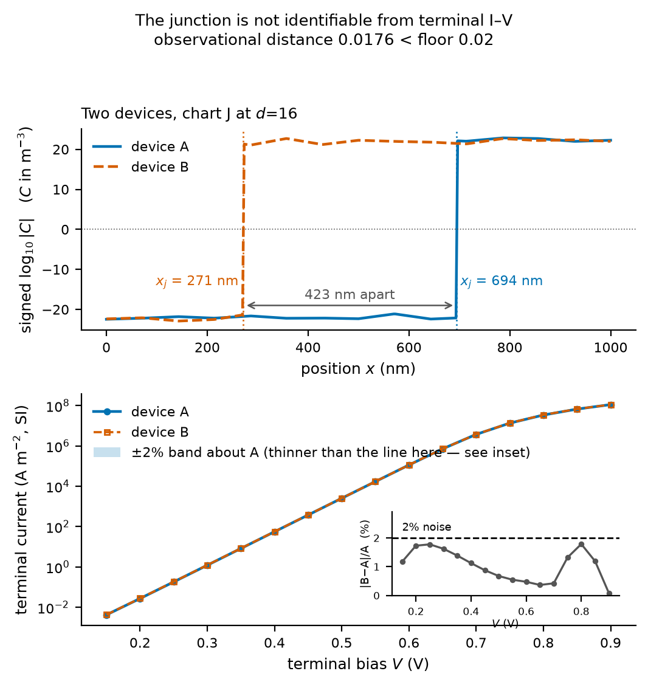
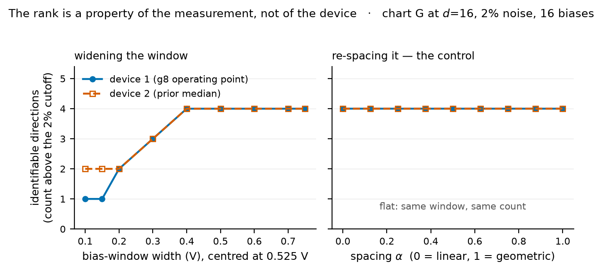
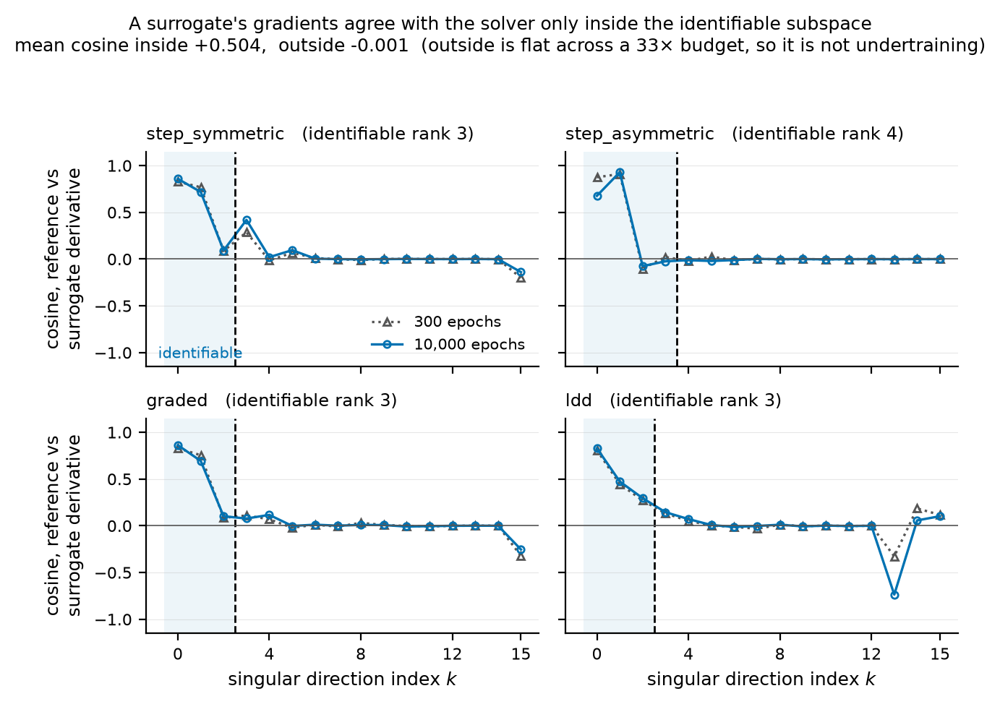

# BayesPINN-Inv: A Validated Drift–Diffusion Reference Solver and a Measured Identifiability Analysis for Inverse Semiconductor Design

**Target venue.** A device/TCAD audience — the headline is what terminal I–V can
and cannot determine about a doping profile, and the identifiability analysis is
the instrument that establishes it rather than the contribution being sold. The
generalisation past semiconductors is confined to §6 and marked there as
conjecture: it rests on one PDE family with no second system tested.

> **Revision note.** This draft was rewritten after a full adversarial audit of
> the codebase (`docs/AUDIT_MASTER.md`). The previous version presented a
> pure-physics PINN as the forward model — which `docs/forward_model_reframe.md`
> documents does not reproduce diode I–V — claimed first-ness without a
> prior-art review, and left `X`/`Y`/`Z` placeholders in the abstract. Those
> claims are withdrawn; see `docs/adr/ADR-0003-scope-of-the-research-claim.md`.

## Abstract

**Two simulated devices whose metallurgical junctions sit 423 nm apart in a
1000 nm device produce terminal I–V curves that differ by at most 1.79% across a
0.15–0.90 V sweep** — indistinguishable on a 2% instrument (Figure 1). That is a
**global** statement, found by direct search in **chart J** at `d=16` rather than
inferred from any local analysis, and the pair is one of the **7 of 13** chart-J
pairs that survive grid refinement. Terminal I–V does not locate the junction. So
the useful question is not *whether* doping recovery is ill-posed — it is known to
be — but **which directions the measurement determines, and what that costs the
tools built on it.**

We answer with a measurement: the singular spectrum of the I–V → doping map,
taken through a Scharfetter–Gummel solver that reports its own numerical error
bar, which we show is predictive and tracks the solver's actual precision as
`1/SNR` across five decades. In **chart L** at `d=16`, a 19-point forward-bias
sweep over an 0–0.9 V window at 2% relative noise determines only **3–4 of 16**
profile degrees of freedom — a *local* rank, at four device families — and
improving the instrument by four orders of magnitude roughly doubles it. The
limit is the structure of the forward map, not the noise.

**That number is a property of the measurement, not of the device.** Of four
candidate sensitivities, only the observation set is large at all twelve
operating points tested (×1.17 end to end, against ×21–×39 for junction position,
dimension and interpolant, which permute freely among themselves). Bias-window
*width* sets the local rank in **chart G** at `d=16` — 1 to 4 and 2 to 4 at two
devices — while the same points spaced differently leave it unmoved. The climb is
the spectrum **flattening** rather than the leading direction broadening.
**Why it flattens is open**, and we report the measured failure mechanism of each
of three pre-registered attempts rather than a plausible story.

**The sharpest consequence is for surrogates.** A surrogate reproducing I–V to
2.6% median error has directional derivatives that agree with the solver only
*inside* the identifiable subspace (mean cosine +0.50) and are uncorrelated with
it outside (−0.00); a 33× training-budget increase cuts value error 4.5× and
leaves the outside agreement at zero, which excludes undertraining. Since those
derivatives are what gradient-based inverse design consumes, *"the surrogate is
accurate"* and *"the surrogate's gradients are usable"* are different claims, and
the spectrum says which directions the second one covers.

**We claim no new method, and are specific about what that concedes.** Every
component is standard and inverse doping recovery is a mature field. What is not
standard is using the identifiability spectrum as a direction-by-direction
*predictor* of surrogate gradient trustworthiness, with a budget control
excluding undertraining; the nearest prior comparison is in another domain,
reaches a more optimistic conclusion, and has no such control. That is a
diagnostic framing and a measured result, not a method. The rest is validation,
measurement and reproducibility — conducted as an adversarial audit that found
fourteen defects in its first two cycles, seven critical, every one present while
the test suite of the day passed. Several claims here are weaker than the
versions we first wrote, each weakened by a falsifier we registered against
ourselves before running it.

## 1. Introduction

TCAD simulation is accurate but slow; terminal characterization underconstrains
device structure. Bayesian inverse design promises "what doping produced this
I–V, and how sure are we?" — but the value of the uncertainty depends entirely
on whether the forward model, the oracle that supervises it, and the evaluation
protocol are correct.

**Contributions.**

1. A Scharfetter–Gummel 1D drift–diffusion solver with an *honest* convergence
   contract: equilibrated continuity solves (1730× improvement in the
   equilibrium mass-action law), a convergence test on carriers rather than the
   potential alone, and a per-solve numerical error bar on the terminal
   current with a demonstrated predictive relationship to the solver's actual
   precision.
2. A quantitative local-identifiability analysis of the I–V → doping map,
   self-limited by its own estimated noise floor and validated against
   independent re-solves — together with the measurement that the resulting
   rank is a property of the *(device, observation set)* pair rather than of
   the device, and that the observation-set half of it is a curve.
3. Witness pairs establishing that the degeneracy is **global** as well as
   local — found in **chart G** at `d=4` and in **chart J** and **chart L** at
   `d=16` — each refined before it is counted, with their barrier geometry
   reported in the search form the measurement actually supports.
4. An evaluation protocol with disjoint interpolation / extrapolation /
   family-transfer splits, labels filtered by the oracle's trust flag, and `n`
   and confidence intervals on every reported statistic.
5. A negative result: uncertainty-driven bias acquisition is **worse than
   random** selection on this task — `max_std` costs −0.31 mean identifiable
   rank against random over 20 (family, budget) cells, winning 2 and losing 9.
   An earlier version of this project reported the weaker claim that it merely
   failed to beat random; that framing is withdrawn and §4.6 records why.
6. A full audit ledger with a regression test for every defect, and an open
   question — why the spectrum flattens — left open, with the three methods
   that failed to close it characterised.
7. The observation that ties the pipeline together: the identifiability
   spectrum **predicts, direction by direction, where a learned surrogate's
   gradients can be trusted**. A surrogate accurate in *value* has directional
   derivatives that agree with the reference solver inside the identifiable
   subspace and are uncorrelated with it outside, and a 33× training-budget
   control excludes undertraining as the explanation. Its placement last in this
   list is an artefact of when it was added, not a judgement of its weight.

**How to read this paper.** §3.2 fixes the vocabulary the rest of it depends on:
a rank is measured *in a chart, at a dimension, over an observation set*, and
numbers carrying different labels are not comparable term by term. §4.1 and §4.2
are the local identifiability measurement and are the paper's centre; §4.3 puts
the same question over finite distances in **chart G** at `d=4` and in **chart
J** and **chart L** at `d=16`; §4.8 is where the measurement earns its keep, by
predicting something about a system it was not measured on. §4.4–§4.7 and §4.9
are the surrounding evaluation, and §4.10 is the audit that produced the
discipline all of it is reported under. A reader with limited time should read
§4.2, §4.3 and §4.8 and treat the rest as support.

**Contribution 7 is last in the list and first in weight.** The list above is in
the order the work happened, and item 7 was added after items 1–6 had already
been published with their numbering; renumbering would break dated references to
"item 6" elsewhere in the project record, so it stays where it is. Read by
importance rather than by accession, the order is item 7, then item 2, then
item 3: §4.8 first, then the identifiability measurement of §4.1–§4.2 that it
rests on, then §4.3. Item 1, the solver's convergence contract, is the
engineering that makes the other three checkable rather than a reason to read
the paper.

**The result in one figure.** Figure 1 is a pair of simulated devices whose
metallurgical junctions sit **423 nm apart in a 1000 nm device** and whose
terminal I–V curves differ by at most **1.79%** over the whole 0.15–0.90 V
window — inside a 2% instrument. Everything else in this paper is an attempt to
say precisely how general that picture is, and under exactly which stated
conditions it holds.

**Figure 1. Two devices, one measurement.** A **global** degeneracy: these two
profiles are far apart, not infinitesimally separated, so no local analysis
could have found them. *Top:* the doping profiles of a
witness pair in chart J at `d=16`, junctions at **694 nm** and **271 nm**.
*Bottom:* their terminal I–V curves over 16 forward biases, with the ±2% band
about device A shaded — narrower than the plotted line at this scale, so the
inset gives the point-by-point relative difference against the 2% level. Every
bias sits below it; the pair's observational distance is **0.0176**, under the
**0.02** distinguishability floor. This pair survives grid refinement
(`N = 301 → 1201`) and is one of the 7 chart-J survivors of §4.3. Generated by
`python scripts/make_figures_g15.py` from `outputs/g8/chart_j.json` and
`outputs/g9/junction_refine.json`; the artefact is `F4.png`, which is its
identifier in `docs/PAPER_AUDIT_g15.md` §5 and is kept stable across documents
rather than renumbered to match the paper.

## 2. Background

### 2.1 Drift–diffusion

Steady-state PDD in SI units with `E = -∇φ`:
$$\nabla\!\cdot(\varepsilon\nabla\phi)=-q(p-n+C),\quad \nabla\!\cdot J_n = qR,\quad \nabla\!\cdot J_p = -qR$$
with $J_n=q\mu_n(nE + V_T\nabla n)$, $J_p=q\mu_p(pE - V_T\nabla p)$, SRH
recombination and ohmic Dirichlet contacts. De Mari scaling throughout.

### 2.2 Related work

Four strands bear on this paper, and all four are engaged below. Two of them —
identifiability methodology and parameterisation-as-regularisation — locate
instruments this paper *uses*, and engaging them costs us something in each case,
which is stated rather than left for a reader to notice. One gap remains open and
is marked as a gap at the end rather than papered over.

Every citation here was checked against a retrievable source and each was opened
and read for the specific claim it is cited for; an unverifiable reference was
removed from this project once already, and the rule that followed is that a
reference we cannot open does not appear, however plausible it sounds.

**(a) Inverse doping recovery from terminal measurements — covered.**
Identification of doping profiles in the stationary drift–diffusion system, its
identifiability and its ill-posedness, are established results
(Burger, Engl, Leitão & Markowich, *Inverse Problems* **17**, 1765, 2001;
*Milan J. Math.* **72**, 273, 2004; Burger, Engl, Markowich & Pietra, *Inverse
Doping Problems for Semiconductor Devices*, Springer, 2002). Bayesian inversion
for this exact problem (arXiv:2408.11485) and ML surrogates for doping
reconstruction (2024) both exist. Inverse device modelling for doping extraction
dates to *Solid-State Electronics* (1990–91). **We add measurement, not method**,
and "recovering doping from I–V is ill-posed" is a known result rather than a
finding of ours.

**(b) Optimal experiment design — covered.** The criteria §4.6 compares are
textbook (Fedorov, 1972; Atkinson & Donev, 1992), and D-/A-optimal design for
infinite-dimensional Bayesian linear inverse problems of exactly this class is
established and scaled (Alexanderian, Petra, Stadler & Ghattas, 2014;
arXiv:1711.05878; arXiv:1802.06517), including goal-oriented and sequential
variants for surrogate-based inversion (arXiv:2402.16520). Our contribution in
that section is a **negative** result about one acquisition function, not a
design method.

**(c) Structural and practical identifiability — covered, and it locates two of
our instruments.** §4.3's barrier measurement is a **profile-likelihood**
construction, and profile likelihood is a named and developed method for exactly
this purpose, principally out of systems biology. Raue et al. (2009) introduced
it as a way to diagnose non-identifiability in partially observed dynamical
models and — the distinction this paper also turns on — to separate *structural*
non-identifiability, which is a property of the model, from *practical*
non-identifiability, which arises from the amount and quality of the data;
Kreutz et al. (2013) review its use. We use the construction and inherit its
known limitation, which Wieland et al. (2021) state: a profile along a
**straight line in a chosen parameterisation** is a one-dimensional slice, and it
bounds the barrier from above rather than locating a minimum-energy path. §4.3
says the same thing in its own voice, and we note here that the limitation is the
method's rather than ours.

That review also bears on §4.1, and not in our favour. Wieland et al. argue that
the classical Fisher-information approach to practical identifiability has severe
shortcomings and that profile likelihood is the better instrument. Our local
analysis is a singular-value spectrum of the forward Jacobian, which is the same
family of object. We use it because it is cheap enough to sweep across devices,
windows and parameterisations — which is what §4.2 needs and what a profile
likelihood at every cell would not have afforded — and the honest reading is that
§4.1 buys breadth at the price of the sharper instrument. Two things follow and
we state both, because the second is a defence and not an excuse. First, the
rank results of §4.1 and §4.2 inherit the criticism. They are reported in the
cautious form the Fisher-information family admits — as `rank(cutoff)`, a curve
over noise levels with its cutoff and its population gap stated rather than a
bare integer (§3.2, §4.1) — but a cautious Fisher-information claim is still a
Fisher-information claim. Second, **§4.3 is not subject to it.** The barrier
measurements, the ridge-against-basin classification and the witness geometry
all rest on a profile-likelihood construction, which is the instrument Wieland
et al. argue *for*. So this paper uses the criticised instrument where it needs
breadth and the preferred one where it makes its geometric claims, and says
which is which.

**Structural identifiability, and why we did not compute one.** The formal
question — whether the map from doping to terminal current is injective at all,
independent of noise and of data — has a standard machinery: differential-algebra
elimination, following Ljung & Glad (1994), with tool support such as DAISY
(Bellu et al., 2007). A structural result would be strictly stronger than
anything §4.3 reports: it would settle **global** non-identifiability as a
property of the model itself, rather than exhibiting witness pairs in **chart G**
at `d=4` and in **chart J** and **chart L** at `d=16` under a declared prior, and
it would not depend on a search budget. **We did not compute one, and the reason is a mismatch of class
rather than of effort.** Those methods take systems of ODEs with polynomial or
rational right-hand sides and eliminate unobserved states symbolically to reach
an input–output relation in the parameters. Our forward map is a *stationary
boundary-value problem* — coupled Poisson and continuity equations solved
numerically under Scharfetter–Gummel discretisation — with the unknown appearing
as a spatially varying coefficient field, not as a finite parameter vector in a
polynomial ODE. There is no input–output equation to eliminate to without first
discretising, and after discretising the object is a `d`-dimensional
parameterisation whose choice is itself part of the claim (strand (d)). A
structural treatment of this problem is a research programme, not a missing
paragraph, and the search in §4.3 is what is available in its absence.

**(d) Parameterisation choice as regularisation — covered, and it is the closest
prior work to the chart construction.** The *chart* framing of §3.2 — that a rank
is undefined until the parameterisation, its dimension and the observation set are
all fixed — is not a new observation about ill-posed problems, and the reason is
Natterer (1977): for an ill-posed problem solved by projection, **regularisation
is carried out by choosing the discretisation parameter**, which is shown there
to be as efficient as Tikhonov–Phillips regularisation. So the discretisation
level *is* a regularisation level. That is exactly why a doping profile recovered
at `d=16` is not the same claim as one recovered at `d=4`, and why an identifiable
count carries its `d`. Our contribution on this axis is not the idea but the
measurement: we vary the interpolant family and the dimension separately, and
report how far each moves the spectrum (§4.2), which the projection-regularisation
literature establishes in principle without quantifying for this problem.

What we have **not** found and therefore do not cite is a treatment of
singular-value analysis of the doping-to-measurement map *specifically* — the
generic method is textbook (Aster, Borchers & Thurber), and whether its
application here is standard practice or a small contribution is a question this
draft cannot settle. It is recorded as an open gap in
`docs/PAPER_AUDIT_g15.md` §6 rather than filled with a plausible reference.

### 2.3 Forward model

The terminal current is directly supervised from the SG oracle rather than
derived from PINN field gradients. In a log-density formulation
$J_n=\mu n_s(\nabla\log n-\nabla\phi)$, the bracket is near zero while $n_s$
reaches $10^6$ in scaled bulk units, so the continuity loss is dominated by the
bulk and the diode signal stays in the numerical noise. This is precisely the
multiscale cancellation SG exponential fitting was invented to handle.

## 3. Method

### 3.1 An oracle that reports its trustworthy range

Two invariants make the solver self-checking:

- **Convergence.** The potential is nearly insensitive to minority carriers, so
  a `max|Δφ|` test declares success on states whose continuity residual equals
  the entire current scale. We require the relative carrier update to converge
  as well.
- **Error bar.** `div(J_n+J_p)=0` exactly ⇒ `J_total` is constant in space; its
  observed spread is `current_noise_floor`.

The second is not merely descriptive. Measured on a 1 µm Si diode, the relative
precision of the terminal current under a small input perturbation tracks
`1/SNR` with `SNR = |I|/current_noise_floor` across five decades — so the
diagnostic can be used *a priori* to choose finite-difference steps and to
reject data.

### 3.2 Identifiability

We analyse the SVD of
$J = \partial\,\mathrm{symlog}\,I(V_b)/\partial\log_{10}|C_i|$, computed by
central differences through the SG solver, so the result characterises the
physics rather than a trained surrogate. Singular values give the forward gain
per decade of doping; comparing against the measurement noise gives an
identifiable rank; the trailing right singular vectors are the profile changes
the measurement cannot see.

**A rank is measured in a chart, at a dimension, over an observation set.**
The premise is not ours and it is old. Natterer (1977) showed that for an
ill-posed problem solved by projection, the discretisation parameter *is* the
regularisation parameter, and that choosing it is as efficient as
Tikhonov–Phillips regularisation. A parameterisation of the doping profile is a
projection, so choosing it and its dimension is choosing a regularisation, and an
identifiable count is a statement about that choice as much as about the device.
"The identifiable rank" is therefore not well defined until three things are
fixed: the parameterisation (which we call a *chart*), its dimension `d`, and
the set of biases measured. Chart L at `d=16` places log-doping anchors on the grid and
interpolates the signed doping arithmetically; chart G at `d=4` and chart J at
`d=16` are the two used for the global search of §4.3. Numbers from different
charts are over different manifolds and are not comparable term by term; where
we put two beside each other we say what licenses it.

**Inherited obstructions are re-tested, not carried.** One habit is worth a
sentence in the methods because it changed results. Where an earlier round of
this work recorded that something could not be done, later rounds re-tested the
obstruction rather than inheriting it — and at least one turned out to be false
on the first attempt, having never been tried. An obstruction inherited from an
earlier round is a claim about the code, exactly as checkable as any other, and
we found they were not being checked.

**A figure is labelled from the code; prose need not be.** The second habit is
one we adopted late and would now adopt first. A sentence can carry a scope
label that nobody checks, because writing permits a decision to be deferred; an
axis cannot be drawn until someone decides what the axis is, so a plotting
script has to read the scope from the code that produced the numbers. Making
Figure 2 did exactly that and found a false label in this paper. Three
sentences, in §4.2 and in the abstract, placed the observation-set measurement
in chart L; the script that draws the width and spacing curves had to name the
chart they were measured in, read it from the code, and found chart G at
`d=16` — the label the project's own claim ledger had carried since the
measurement was made. The numbers were right at every site and only the label
was wrong, and it had passed a guard that requires each rank statement to carry
a chart label, because that guard checks that a label is present and cannot
check that it is right. We record the correction rather than absorb it
(`COR-2` in the project's corrigenda) and draw the general conclusion: **a
figure is a stronger correctness check on a claim than prose is**, because
drawing forces the resolution that writing lets you defer. Each result figure
in this paper is generated by a script that reads its labels from the artefact
or the code, not from this text.

**The analysis is self-limiting.** A Jacobian estimated with per-entry noise
$\eta$ has, by Weyl's inequality, no resolvable singular value below
$\eta\sqrt{BP}$. We estimate $\eta$ from the oracle's own reported noise floor
and report anything below the induced spectral floor as unresolvable.

This matters: our *first* version of this analysis used a 1e-3-decade step and
accepted any bias point with SNR > 10. It produced a clean spectrum decaying
over six orders of magnitude and an identifiable rank of 6. It was entirely
noise — an independent re-solve showed the measured response along the *exact
null space* was the same size as along the most observable direction. An SVD
will always return a plausible spectrum, including from pure noise.

## 4. Experiments

### 4.1 Local identifiability (main result)

Chart L at `d=16`: a 19-point forward-bias observation window (0–0.9 V), 16
profile nodes, 2% relative measurement noise, Jacobian through the SG solver.
The prior is the chart's own uniform prior over log-doping anchors; the noise
model is relative Gaussian on the terminal current; the distinguishability
floor is the solver's reported `current_noise_floor` and the discretisation
floor is 1.5e-3 log-units.

| Device (chart L, `d=16`, local) | Bias points used | Identifiable dof (of 16) |
|---|---:|---:|
| step, symmetric (1e22 / 1e22 m⁻³) | 10 | **4** |
| step, asymmetric (1e21 / 5e22) | 11 | **5** |
| graded (tanh, $L_g$ = 150 nm) | 10 | **3** |
| LDD (three-segment) | 8 | **4** |

*Validation.* Predicted response $\|Jv\|$ vs an independent re-solve: ratios
**0.995–1.04** for all resolved directions across all four families. Conclusion
stable across finite-difference steps (0.01–0.05 decades) and SNR thresholds
(1e4–1e8): identifiable rank 4, $\sigma_1/\sigma_2 = 6.11$–6.13.

*Rank vs instrument quality* (symmetric step, chart L, `d=16`, local): 2 dof at
20% noise, 4 at 2%, 6 at 0.1%, 9 at 1e-4%. Four orders of magnitude of
instrument improvement buys roughly a doubling. The rank is a **threshold
count** at this denominator, not a boundary between two populations of singular
values, which is why every figure here travels with the noise level that set
it; §4.2 shows the gap that would license a bare integer collapsing from 230.6×
to 4.99× as the window widens.

*Equivalence twins.* For every family, a profile differing by up to 1.26×
locally changes the I–V by 0.02–1.3% — below a 2% noise floor. Two physically
distinct devices, one measurement.

### 4.2 The rank is a property of the measurement, not of the device

*Shape of this section.* Three measurements, then the statement we defend, then
how we failed to explain it. The measurements come first and stand on their own;
the boxed paragraph after them is the whole of what this section claims, and a
reader who wants only that can stop there. Everything after it is three
pre-registered attempts to explain the third measurement, reported at length
because a characterised failure is the useful form of a negative result — and
kept after the claim rather than before it, because they qualify the explanation
and not the finding.

The number in §4.1 is a property of a *pair* — the device and the observation
set — and the observation-set half is a curve rather than a constant. Two
measurements make that concrete, both at 2% relative noise. Their scopes differ
and the difference matters: the first varies the parameterisation *itself* as
one of the four axes it compares, so it is not conducted inside any single
chart; the second is in **chart G** at `d=16`. Neither is the chart-L
measurement of §4.1, and a rank from one is not comparable term by term with a
rank from another (§3.2).

**The observation set dominates three other candidate sensitivities.** We
compared four axes — which biases are measured, where the junction sits, the
parameterisation dimension, and the interpolant family — at twelve operating
points (three devices × three bias windows, plus the reference point). Only one
is large at all twelve. The observation set's effect spans **0.925–1.080** from
end to end, a factor of **1.17**; junction position spans ×26, dimension ×21 and
interpolant ×39. So the picture is not a four-way ordering but
**one-against-three**: at 12 of 12 operating points tested, what you measure
dominates the local spectrum, while the other three trade places among
themselves depending on the device and the window.

**Bias-window *width* sets the rank; spacing does not.** Over 16 bias points at
2% noise in **chart G** at `d=16`, widening the window from 0.10 V to 0.75 V about a
fixed 0.525 V centre takes the identifiable count from **1 to 4** at one device
and **2 to 4** at a second. Redistributing the same number of points at a
different spacing moves the log-decay slope by **2.1% and 2.8%** at those two
devices, against **56% and 58%** along the width axis, and moves the rank not at
all (`rank(observation set)`, `outputs/g9/rank_obs.json`). **Figure 2** is the
whole of this measurement: one curve that rises and one that does not, on a
shared axis.

**Figure 2. The rank is a property of the measurement.** *Left:* identifiable
directions against bias-window width, widened about a fixed 0.525 V centre, at
two devices. *Right:* the control — the same number of bias points over the same
fixed 0.15–0.90 V window, redistributed from linear to geometric spacing. Both
panels share a y-axis, because the result is that one curve rises and the other
does not. Chart G at `d=16`, 2% relative noise, 16 bias points throughout.
Generated by `python scripts/make_figures_g15.py` from
`outputs/g9/rank_obs.json`; artefact `F2.png`.

**The climb is the spectrum flattening, not the leading direction broadening.**
The identifiable count is the number of singular values above an *absolute*
cutoff fixed by the noise, so a rigid spectrum sliding upward would also raise
it. That is not what happens. Across the widths `σ₁` moves by a factor of only
1.148–1.195 and moves **downward**, which is the wrong direction to raise a count
against a fixed cutoff, while `σ₂…σ₄` rise by ×21–×535 in the normalised
spectrum. Decomposing each trailing value's motion into a scale term and a shape
term puts **95.6%–97.9%** of it in the shape term, at every device and every
index. Nor is it the leading right singular vector broadening to cover more of
the profile: `v₁`'s spatial extent moves under 2.5% on a 0.0625–1.000 scale, and
where it moves at all it *recedes* from the junction.

**The statement we are willing to put our name to is this one.**

> The rank climb is spectrum flattening rather than the leading direction
> broadening. The flattening exceeds what row count alone produces — nested
> windows are consistently *less* flat than random row-subsets of equal size —
> but the excess is largely attributable to the spread of the biases in the
> window, a smoothness property, and the residual after removing it does not
> reproduce across held-out devices. **The mechanism remains open.**

Everything above is measurement and the paragraph above is the claim. The rest
of this section is provenance and failure: where the framing came from, and the
three pre-registered attempts to close the mechanism that did not close it. It
qualifies the *explanation*; none of it qualifies the three measurements.

**The first measurement was pre-registered the other way round.** Generation 8 of
the audit reported a *ranking* of the four axes from a single operating point;
`SPEC-g9-1` registered the falsifier that the ranking must reproduce at further
points, and it fired — **2 of 12** points reproduce the original order under one
statistic and **0 of 12** under the other. The surviving claim is the weaker and
more useful one above. We report it this way because the stronger version was
ours.

**Why the spectrum flattens is open, and we say so rather than supplying a
plausible story.** Three methods were tried across four generations of the audit,
each pre-registered before it ran, and none answered it:

1. *Spatial localisation of the singular vectors.* Falsified — the vectors
   localise **more** as the window widens, the opposite of the prediction,
   tracking width at −0.433.
2. *The row side — which bias rows carry the trailing directions.* Falsified out
   of sample. The statistic is confounded with the split ratio `b = n_out/n_rows`
   and the two axes being contrasted do not overlap in it: `corr(dz, b)` runs
   −0.95 to −0.98, and the device-to-device offset spread is 1.572 against a
   largest axis difference of 0.22 at matched `b`.
3. *Row-subset growth against a random-row null matched on row count.*
   Inconclusive, for a reason worth stating exactly. The pre-registered decision
   rule returned its deflationary label, but the registered *meaning* of that
   label — that the nested windows track the null — is contradicted by the
   measurement that produced it: all four devices sit **above** the chain null in
   the same direction, three at *p* ≤ 0.005, consistently *less* flat than random
   row-subsets of equal size. Neither registered outcome describes what happened,
   and relabelling after reading the result is not available.

Characterising that third result narrows the question without closing it. The
departure from the null tracks the *spread* of the biases in the subset —
`corr(gap, spread)` of −0.31, −0.59, −0.49, −0.45 — which is a smoothness
property of any smooth response rather than a property of a device or a transport
regime. Regressing the spread out leaves a residual at the 0.880 and 0.892
percentiles at two contrast devices, but **0.492 — exactly ordinary — at one
held-out device against 0.947 at the other**. The two held-out devices disagree,
so the part of the departure that is not generic smoothness does not reproduce.

That is the whole of the evidence behind the boxed paragraph above, and it is
why that paragraph ends where it does.

One hypothesis survives and we name it as future work without claiming it.
Contiguous bias windows have more collinear Jacobian rows than scattered ones, so
a contiguous window spans less and decays more steeply — which would explain both
why nested windows come out less flat than random subsets and why bias spread
accounts for most of the departure. That is a statement about **conditioning**
rather than about new information arriving with new rows. It is consistent with
everything measured here and established by none of it, and testing it needs
devices this analysis never touched.

### 4.3 The degeneracy is global as well as local, and its geometry depends on the dimension

A local Jacobian rank is a statement about an infinitesimal neighbourhood. It is
structurally incapable of detecting whether two *far apart* profiles produce the
same measurement, so we searched for such pairs directly. An oracle-arbitrated
search over 1,999,000 candidate pairs in **chart G** at `d=4` returned **13
witness pairs**: profiles up to **8.18×** apart in doping whose I–V curves differ
by **1.23%**, below the 2% noise floor. A second search in **chart J** at `d=16`
returned **13 witness pairs** at up to **14.75×**, and a third in **chart L** at
`d=16` returned **37**. Two of the headline pair's members have junction depths
of **694 nm and 271 nm** — a difference that survives grid refinement, moving
1.7% under `N = 301 → 1201`. That pair is **Figure 1**.

Existence transfers between searches; frequency does not. Three searches at three
budgets over three priors are existence proofs, and we do not compare how *often*
degeneracy occurs in one chart against another.

**Every witness is refined before it is counted** (`WIT-02`), because a witness
pair that is an artefact of the grid is not a witness. All three committed sets
have now been through the battery, and **all three lost members**: chart G at
`d=4`, **13 of 13 refined and 12 surviving**; chart J at `d=16`, **13 of 13
refined and 7 surviving**; chart L at `d=16`, **37 of 37 refined and 26
surviving**. The live register is `outputs/close/wit02_register_v3.json`. Under
`WIT-01` the admissibility ratio is **1.000** in all three charts — every pair
qualifies on a doping magnitude, and magnitudes reach the grid exactly — which is
a result worth stating rather than assuming, because *"the rule does not bite
here"* and *"the rule was never applied here"* are different sentences and only
one of them is checkable.

**Full coverage buys less than it sounds like it does.** `WIT-02` tests
witnesses, not connectivity. It converts no `d=16` result into a separation, and
that distinction is the next paragraph.

**How much of this rests on the 2% figure.** The floor is the noise level, so
every witness distance can be re-read as the instrument at which that pair stops
being a witness, and the sets can be reported as a sensitivity rather than at a
single point. Taking each surviving pair's **worst** distance over the six-point
refinement battery — the conservative direction, since it is the earliest floor
at which the pair could separate under any configuration already run — the
committed sets retain an indistinguishable pair down to **1.24%** relative noise
in chart G at `d=4`, **1.52%** in chart J at `d=16` and **1.26%** in chart L at
`d=16`. So the global degeneracy statement survives a **1.6× better instrument**
than the one it is stated at, and the conclusion is not poised on the 2%.

Two things that number does *not* say, both of which cut against us. First, the
sets are not intact over that range: every set begins losing members almost
immediately, since its widest pairs sit at **0.99–1.00 floor units**, and what
persists to 1.24% is the *tightest* pair rather than the set. Second, and more
important, this is a sensitivity of **these pairs**, not of the phenomenon. A
search conducted at a lower floor would draw new candidates and could return
pairs tighter than any here; nothing in this analysis bounds that, and it is a
different experiment rather than a rescaling of this one. The same caveat applies
to the noise *model*: the arithmetic here moves the level of a relative-Gaussian
floor and says nothing about a floor of another shape (`floor(sensitivity)`,
`outputs/floor_sensitivity_g15/floor_sensitivity.json`).

**What the barrier measurement does and does not establish.** For each pair we
compute the profile-likelihood barrier along the straight line between its
members in that chart's own coordinates, against a null control of ordinary prior
draws at the same path length. In chart G at `d=4` the median barrier over the
twelve surviving pairs is **0.81 floor units** with 6 of 12 at or below the floor
barrier — a *ridge*. At `d=16` both charts sit far above it: chart J at **59**
floor units and chart L at **222.8** over its twenty-six survivors, with **0 of
26** at the floor barrier — *basins*. What the chart moves at matched `d` is the
**depth**: 13× in witness-to-null ratio between two charts with matched path
lengths.

**These are search statements, not separation proofs**, and the direction of the
inequality is unfavourable. A straight-line barrier is an **upper bound** on the
true barrier, so a shallower connecting path may exist; we did not compute the
minimum-energy path. A basin claim rests on finding *no* connecting path below
the floor, and an upper bound cannot establish that none exists. So the honest
form is: **no connecting path below the floor was found along the straight
line.** Refinement does not repair this and we do not claim it does.

The reading that survives is about the **dimension**, not the chart: pairs sit at
the instrument floor at `d=4` and do not at `d=16` in either chart tested. An
earlier version of this section said the opposite — *a ridge in one chart and
isolated basins in another* — and that chart-dependent reading was withdrawn when
the third chart was measured at matched `d`.

**What predicts survival is not known.** The two 13-pair sets suggested that
headroom against the distinguishability floor predicts which pairs survive
refinement, with the split at 93.65% of the floor in chart J against 98.9% in
chart G. On chart L — the 37-pair set, the largest, and the only one that did not
help form the rule — concordance is **0.479** against 0.500 for a coin, and the
surviving and separating bands overlap from 0.53 to 1.00 floor units. No margin
band was adopted and none is defensible. This strengthens rather than weakens the
refusal to adopt one: the observed split in the two forming sets was 1.4
percentage points wide, which is narrow enough that any threshold inside it would
be tuned.

### 4.4 Forward accuracy

| Test set | Median rel. error (95% CI) | p90 | n |
|---|---:|---:|---:|
| Interpolation (within training band) | 2.8% (2.0–3.9%) | 7.0% | 72 |
| **Extrapolation** (outside the band) | 38.2% (23.1–89.7%) | 861% | 68 |
| Family transfer (graded; trained on steps) | 84.2% (75.0–106.4%) | 151% | 60 |

Measured current dynamic range of the training labels: **9.96 decades**
(8.9e-5 → 8.1e5 A/m²), after dropping 13 of 169 candidate (profile, bias) pairs
whose SG current lay below the solver's own noise floor.

### 4.5 Inverse recovery and calibration

Single-level recovery (the well-posed sub-problem): 0.0018 decades at 0% noise
rising to 0.0072 at 10% (n=40 per row). 1σ coverage falls 75% → 28% as noise
grows, showing the ensemble spread captures epistemic uncertainty only and does
not absorb measurement noise.

Calibration, **pre and post on the identical test set** (n=140), variance
inflation $T=2.08$ fitted on a disjoint split:

| Interval | Raw | Recalibrated | Nominal |
|---|---:|---:|---:|
| ±1.0σ | 29% (22–37%) | 62% (54–70%) | 68% |
| ±1.64σ | 46% (38–54%) | 90% (84–94%) | 90% |
| ±2.0σ | 59% (50–66%) | 98% (94–99%) | 95% |

### 4.6 Experiment design: uncertainty acquisition is worse than random

An earlier version of this section reported that `max_std` acquisition showed
"no distinguishable advantage" over random. Re-measured against the quantity
the inverse problem actually cares about — how many doping degrees of freedom
the chosen measurements determine — it is not neutral but **actively harmful**.

Four device families × five budgets × twelve random seeds. Every strategy
draws from the same candidate pool; acquisition may consult only the
*surrogate* Jacobian and the *surrogate* σ, while scoring uses the SG Jacobian
that no strategy could see.

| Strategy | mean Δ identifiable rank vs random | win / tie / loss |
|---|---:|---|
| `max_std` (predictive uncertainty) | **−0.31** | 2 / 9 / 9 |
| `d_optimal` (log det Fisher information) | **+0.39** | 5 / 15 / 0 |
| `null_space` (signal along unresolved directions) | **+0.39** | 5 / 15 / 0 |
| `std_x_nullspace` | +0.24 | 4 / 14 / 2 |
| `e_optimal` | −0.06 | 2 / 13 / 5 |

The interpretation is that predictive uncertainty and inverse identifiability
ask different questions. Uncertainty asks *where is the forward model unsure?*;
the inverse problem needs *which measurement constrains a direction I currently
cannot see?* A bias the surrogate predicts confidently can still be the only
one that resolves a given profile direction.

The design criteria used are textbook (Fedorov, 1972; Atkinson & Donev, 1992;
Alexanderian et al., 2014) and **no methodological novelty is claimed**. Two
bounds are stated rather than hidden: the gain is modest (≈0.4 of a rank unit
on a base of 3–4), and it is obtained despite planning with a surrogate
Jacobian that correlates only +0.01…+0.40 with the truth — which §4.8
explains.

### 4.7 Is the uncertainty useful?

A predictive standard deviation is only worth reporting if it tracks the error.
Spearman ρ(σ, |error|) = **+0.824** (n=200), and going from interpolation to
extrapolation σ inflates **15.7×** against an error inflation of 11.8× — the
ensemble does detect that it is extrapolating.

It is not, however, a calibrated error estimate out of distribution. Median
|error| across ascending σ quartiles is 0.008, 0.031, 0.373, 0.254 — *not*
monotone: on the unseen graded family the ensemble reports σ = 0.67 against an
actual error of 0.27. It errs toward caution, which is the safe direction, but
σ over-states the error where the model is least familiar.

### 4.8 Surrogate accuracy does not imply surrogate gradients

If terminal I–V determines only 3–4 of 16 doping directions in **chart L** at
`d=16` **at a given operating point**, over the 0–0.9 V bias window and at 2%
measurement noise — a *local* Jacobian rank, not a global claim, and one that
`rank(observation set)` shows moving with the window — then a surrogate trained
only on I–V is constrained only in that subspace. Along the remaining
11–13 directions no training signal distinguishes one behaviour from another,
so its *derivatives* there are unconstrained — even where its *values* are
excellent. Those derivatives are precisely what gradient-based inverse design
and Jacobian-based experiment design consume.

We state the prediction first and then test it. Decomposing the true Jacobian
$J = U\Sigma V^{\mathsf T}$, we compare the directional derivatives
$J v_j$ and $\hat J v_j$ of the SG solver and the surrogate along each right
singular direction, over four device families:

| Training budget | mean cosine, $j <$ identifiable rank | mean cosine, $j \ge$ rank | mean value error (symlog) |
|---:|---:|---:|---:|
| 300 | +0.47 | +0.003 | 1.133 |
| 10 000 | **+0.504** | **−0.001** | **0.252** |

The control excludes the obvious alternative explanation. Over a 33×
increase in training budget the surrogate's *value* error falls 4.5×, while
its agreement outside the identifiable subspace stays pinned at zero. There is
nothing to learn there, so more training does not help — which is what
ill-posedness predicts. **Figure 3** shows both budgets against every direction,
one panel per device family, with each device's own cutoff drawn: the two
budgets separate inside the identifiable subspace and lie on top of each other
outside it, which is the control in one glance.

**Figure 3. Where a surrogate's gradients can be trusted.** Cosine between the
SG solver's and the surrogate's directional derivatives along each right
singular direction $v_j$, for four device families at two training budgets. The
shaded region and the dashed line mark each device's *own* identifiable rank —
a property of the reference Jacobian, not of the surrogate, and identical at
every budget. Agreement is high inside the subspace and indistinguishable from
zero outside it, and the 33× budget increase moves the inside and leaves the
outside where it was. The scattered large cosines at the highest few $j$ carry no
information and should be read as absent rather than as disagreement: those
directions have $\sigma_j$ **exactly zero** and reference derivative norms of
order $10^{-17}$, so the quantity being plotted is the angle between two vectors
that are numerically zero. Generated by `python scripts/make_figures_g15.py` from
`outputs/gradient_fidelity/gradient_fidelity.json`; artefact `F6.png`.

The nearest prior work we found is Yu, Cai & Liu (arXiv:2604.04107), who
compare autodiff gradients of a neural surrogate against theoretical
sensitivity kernels for surface-wave dispersion and report that the main
structure *is* recovered, with artefacts traceable to structure in the
training data. Our contribution is narrower and more specific: the
identifiability spectrum of the forward map **predicts, direction by
direction, where a learned surrogate's gradients can be trusted.**

### 4.9 Three uncertainty backends under one protocol

The three UQ backends had never been compared, because MC-dropout and SWAG
wrapped the superseded pure-physics PINN rather than the surrogate under
evaluation. With all three attached to the surrogate and returning the same
prediction type, and after a hyperparameter search for each selected on the
calibration split (never on test):

| Method | ρ(σ,\|err\|) | NLL calibrated | σ inflation (extrap) | error inflation (extrap) |
|---|---:|---:|---:|---:|
| Deep ensemble (M=5) | **+0.798** | **−1.452** | **21.3×** | 12.1× |
| MC-dropout (tuned) | +0.299 | 18.737 | 1.4× | 12.4× |
| SWAG (tuned) | +0.486 | 1.814 | 2.5× | 13.2× |

The mechanism is in the last two columns. Under distribution shift the error
grows ~12–13× for all three, but MC-dropout's and SWAG's σ is governed by
their own hyperparameters — the dropout rate, the width of the SWA trajectory
— which are properties of the model rather than of distance from the data. The
ensemble's σ is functional disagreement between independently trained members,
and that does grow. A budget-matched ensemble, trained *faster* than either
single-network method, still beats both, so this is not a compute advantage.

A secondary observation worth recording: selecting UQ hyperparameters by
in-distribution NLL systematically prefers small σ, and small σ is exactly
what fails out of distribution.

### 4.10 What the audit found

Fourteen defects across two audit cycles. Four produced silently wrong physics
while the test suite of the day passed:

- **The most recent one survived a 161-test suite that had itself been written
  by an audit.** The Gummel carrier-convergence test was *relative*, applied to
  an array spanning 16 decades; entries far below the array maximum can never
  reach it, so the solver reported failure on states whose potential had
  converged to 1e-12. Because the bias-continuation loop aborts on the first
  step that reports failure, `solve()` then returned the *cold-start* state:
  currents wrong by three to five orders of magnitude, and of the wrong sign
  under reverse bias, across the top two decades of the claimed doping range.
  The fix distinguishes round-off stagnation from divergence using a threshold
  that separates the two populations by eleven orders of magnitude, so it is
  not tuned.

- The Gummel loop reported `converged=True` on states whose continuity residual
  equalled the entire current scale, because it tested only the potential.
- The 2D MOS-cap Newton Jacobian had the **wrong sign** on the charge
  derivative, so the solver diverged for every $|V_g| \gtrsim 1$ V. The
  documented "strong-inversion stiffness" limitation was this bug; with the sign
  corrected, the solver converges from −2 V to +5 V with relative residuals
  ~1e-12 and reproduces textbook inversion pinning near $2\phi_F$.
- The ohmic boundary condition computed the minority carrier as a difference of
  two numbers equal to machine precision, giving a 0.35% mass-action error at an
  ordinary $10^{23}$ m⁻³ and exactly zero (hence NaN) at $10^{25}$ m⁻³ — the top
  two decades of the range the project claimed to support. The correct stable
  formulation already existed in a sibling module whose docstring claimed to
  "match the SG solver convention".

## 5. Limitations

- Terminal-current noise floor ~2e-6 A/m² near equilibrium; irreducible in a
  density-based formulation at float64. Measured and reported, not removed.
- Surrogate extrapolation and family transfer are poor (38%, 84% median error).
- The rank in §4.1 is *local* — a Jacobian at one operating point, in one
  chart, at one dimension, over one observation set. It is robust to the
  parameterisation dimension (P = 8 → 32 leaves it at 2–4), so it is a property
  of the measurement and not of the discretisation; it is **not** robust to the
  observation set, which is the subject of §4.2 and the reason every figure here
  travels with its window.
- **The local rank is a Fisher-information-family statement, and that family
  has a known critic.** Wieland et al. (2021) argue that Fisher-information
  approaches to practical identifiability have severe shortcomings against
  profile likelihood, and the Jacobian spectrum of §4.1 is that family. The
  rank results inherit the criticism, softened but not removed by being reported
  as `rank(cutoff)` with the cutoff and the population gap stated. The results
  of §4.3 do not inherit it: the barrier measurements and the ridge-against-basin
  classification are profile-likelihood constructions, the instrument that
  review prefers, so the geometric claims rest on the preferred instrument and
  the rank claims on the criticised one.
- **The mechanism behind the rank climb is unexplained.** §4.2 converts *"the
  rank climb is unexplained"* into a measured description of *what* moves. It
  does not say why widening the bias window compresses the spectrum, and the
  three methods that tried are characterised rather than counted.
- **Both `d=16` barrier results are searches, not separations.** No connecting
  path below the floor was found along the straight line; the minimum-energy
  path was not computed. A straight-line barrier is an upper bound, and for a
  basin claim that is the unfavourable direction.
- **What predicts refinement survival is not known.** The headroom rule that the
  two 13-pair sets suggested carries no information on the 37-pair set
  (concordance 0.479 against 0.500 for a coin). No margin band is adopted.
- **The ridge/basin classifier is binary over three cells.** The numbers beneath
  it are not, and only the chart-L-against-chart-J contrast is matched in both
  path length and dimension.
- **Everything here is bounded above by 0.9 V.** That is the top of the
  convergence sweep and it has never been validated as a limit. *Unvalidated
  above* is not *fails above*, and we make no claim about either.
- **No result in this paper has been evidenced on any interpreter but CPython
  3.11 or any operating system but the development one**, which is Windows. The
  declared floor is `>=3.11`, and it is there because only versions the suite has
  actually been run on are declared. The CI matrix has been triggered but has
  never *executed*: no job has started, for an account-level reason unrelated to
  the code, so the 3.12 and clean-runner legs are **unevaluated, not passing**.
  Linux and macOS are unvalidated and say so in every manifest — and since three
  of the four matrix legs are Linux, portability is the least-evidenced claim in
  this paper.
- The gradient-fidelity result (§4.8) is measured on four device families in
  1D with one surrogate architecture. Whether the inside/outside separation is
  as sharp for other architectures or in 2D is untested.
- The experiment-design gain (§4.6) is modest (≈0.4 rank) and is obtained with
  a surrogate Jacobian that correlates only +0.01…+0.40 with the truth. A
  better forward model would plausibly change the size of the effect.
- The pure-physics PINN is retained but not developed; it predicts essentially
  zero current (§4.10).
- 1D transport only; the 2D solver handles Poisson without continuity.
- Boltzmann statistics, constant mobility, no interface traps.
- **Those model restrictions are stated but their effect on the conclusion is
  untested.** Listing them is not the same as knowing the identifiability result
  survives them, and we have not asked the question in 2D, with field-dependent
  mobility, or with interface traps. The restrictions bound what the numbers
  describe; they do not bound how much the numbers would move.
- **The noise model is assumed, not argued.** Every count in this paper is a
  threshold against independent Gaussian noise in *relative* current at 2%, and
  we have no measurement or reference justifying that shape. Real I–V is not
  relative-Gaussian across ten decades — near the floor it is closer to additive,
  and an instrument switches ranges — so the honest statement is that the results
  are conditional on a noise model we chose for tractability. §4.3 reports how
  far the *level* can move before the global conclusion changes; nothing here
  tests a change of *shape*, which would need a different search rather than a
  rescaling of this one.
- **The measurement chain is absent from the forward model, and this is the
  sharpest of these limitations.** There is no series resistance, no
  self-heating, no contact non-ideality and no temperature drift. That matters
  more than a generic simulation caveat, because §4.2's rank gain comes from
  *widening the bias window*, and the top of that window is exactly where series
  resistance and self-heating dominate a real diode's I–V. The mechanism that
  produces this paper's observation-set result is the mechanism a real
  measurement chain would most distort. We do not know the direction or the size
  of the effect, and nothing in this work bounds it.
- **The global results depend on a prior and we do not know how much.** The
  witness pairs are drawn from a stated uniform prior over log-doping anchors
  (hashed with the run; chart J's junction coordinate carries its own prior and
  its own hash), and nothing establishes anything outside it — a narrower
  physical prior could exclude these witnesses entirely. Existence transfers
  between searches and frequency does not, so we report the pairs as existence
  proofs under a declared prior and make no claim about how common the
  degeneracy is under any other.

## 6. Conclusion

The scientifically useful outputs of this project are a reference solver that
knows where it stops being reliable, a measured statement of how little of a
doping profile terminal I–V can determine — and of how much that statement
depends on which biases you measure rather than on the device — witness pairs
showing the degeneracy is global and not only local, the observation that the
local limit propagates into the *gradients* of any surrogate trained on those
measurements, and an audit trail showing how easily plausible numbers survive a
passing test suite. Three results are negative — the pure-physics PINN does not
work as a forward model, uncertainty-driven acquisition is worse than random,
and neither MC-dropout nor SWAG is competitive with a deep ensemble here — and
each is reported with the mechanism that explains it. One question is left
**open**: why the spectrum flattens as the bias window widens. We report the
three pre-registered methods that failed to answer it, each with its measured
failure mechanism, because a characterised failure is more useful to the next
person than a plausible mechanism we could not test. None of it is a new
method, and
the paper does not claim one.

**A conjecture, labelled as one, about what might transfer.** Everything above is
evidenced on a single PDE family — stationary drift–diffusion in one dimension —
and we have tested no second system. What we would *expect* to transfer, and are
explicitly not claiming, is the bookkeeping rather than any number: that in an
ill-posed inverse problem the parameterisation is not a presentational choice but
part of the claim, so that an identifiable count is undefined until the chart,
the dimension and the observation set are fixed; and that where a surrogate's
gradients can be trusted is predicted by the identifiable subspace of the map it
was trained on, rather than by its value accuracy. Both are statements about
discretised ill-posed problems in general and neither is specific to
semiconductors, which is exactly why neither is established by the evidence here.
Testing them needs a second forward model with a different physics and the same
protocol, and that experiment has not been run. We flag this because a reader
may find the framing more portable than the device result, and a portable framing
supported by one system is a hypothesis, not a finding.

## References

- Burger, Engl, Leitão & Markowich (2001). Identification of doping profiles in semiconductor devices. *Inverse Problems* **17**, 1765.
- Burger, Engl, Leitão & Markowich (2004). On inverse problems for semiconductor equations. *Milan J. Math.* **72**, 273.
- Burger, Engl, Markowich & Pietra (2002). *Inverse Doping Problems for Semiconductor Devices*. Springer.
- Bayesian inversion for the identification of the doping profile in unipolar semiconductor devices (2024). arXiv:2408.11485.
- Data-driven solutions of ill-posed inverse problems arising from doping reconstruction in semiconductors (2024). *Applied Mathematics in Science and Engineering*.
- A problem-specific inverse method for two-dimensional doping profile determination from C–V measurements (1991). *Solid-State Electron.*
- Physical parameter extraction by inverse device modelling: 1D and 2D doping profiling (1990). *Solid-State Electron.*
- Efficient D-optimal design of experiments for infinite-dimensional Bayesian linear inverse problems. arXiv:1711.05878.
- Goal-oriented optimal design of experiments for large-scale Bayesian linear inverse problems. arXiv:1802.06517.
- Sequential design for surrogate modeling in Bayesian inverse problems. arXiv:2402.16520.
- Scharfetter & Gummel (1969). Large-signal analysis of a silicon Read diode oscillator. *IEEE Trans. Electron Devices* **16**, 64.
- De Mari (1968). An accurate numerical steady-state one-dimensional solution of the P-N junction. *Solid-State Electron.* **11**, 33.
- Raue, Kreutz, Maiwald, Bachmann, Schilling, Klingmüller & Timmer (2009). Structural and practical identifiability analysis of partially observed dynamical models by exploiting the profile likelihood. *Bioinformatics* **25**(15), 1923–1929. doi:10.1093/bioinformatics/btp358.
- Kreutz, Raue, Kaschek & Timmer (2013). Profile likelihood in systems biology. *The FEBS Journal* **280**(11), 2564–2571. doi:10.1111/febs.12276.
- Wieland, Hauber, Rosenblatt, Tönsing & Timmer (2021). On structural and practical identifiability. *Current Opinion in Systems Biology* **25**, 60–69. doi:10.1016/j.coisb.2021.03.005. arXiv:2102.05100.
- Ljung & Glad (1994). On global identifiability for arbitrary model parametrizations. *Automatica* **30**(2), 265–276. doi:10.1016/0005-1098(94)90029-9.
- Bellu, Saccomani, Audoly & D'Angiò (2007). DAISY: A new software tool to test global identifiability of biological and physiological systems. *Computer Methods and Programs in Biomedicine* **88**(1), 52–61. doi:10.1016/j.cmpb.2007.07.002.
- Natterer (1977). Regularisierung schlecht gestellter Probleme durch Projektionsverfahren. *Numerische Mathematik* **28**(3), 329–341. doi:10.1007/BF01389972.
- Aster, Borchers & Thurber (2018). *Parameter Estimation and Inverse Problems*, 3rd ed.
- Higham (2002). *Accuracy and Stability of Numerical Algorithms*, 2nd ed.
- Lakshminarayanan, Pritzel & Blundell (2017). Deep ensembles. *NeurIPS*.
- Maddox et al. (2019). SWAG. *NeurIPS*.
- Fedorov (1972). *Theory of Optimal Experiments*. Academic Press.
- Atkinson & Donev (1992). *Optimum Experimental Designs*. Oxford.
- Alexanderian, Petra, Stadler & Ghattas (2014). A-optimal design of experiments for infinite-dimensional Bayesian linear inverse problems with regularized ℓ0-sparsification. *SIAM J. Sci. Comput.* **36**(5), A2122–A2148.
- Yu, Cai & Liu (2026). Physical sensitivity kernels can emerge in data-driven forward models: evidence from surface-wave dispersion. arXiv:2604.04107.
- Gal & Ghahramani (2016). Dropout as a Bayesian approximation. *ICML*.
- Kuleshov, Fenner & Ermon (2018). Accurate uncertainties for deep learning using calibrated regression. *ICML*.
- Gneiting & Raftery (2007). Strictly proper scoring rules. *JASA* **102**.
- Raissi, Perdikaris & Karniadakis (2019). Physics-informed neural networks. *JCP* **378**, 686.
- Rudin, Osher & Fatemi (1992). Nonlinear total variation based noise removal. *Physica D* **60**, 259.
- Sze & Ng (2007). *Physics of Semiconductor Devices*, 3rd ed.
